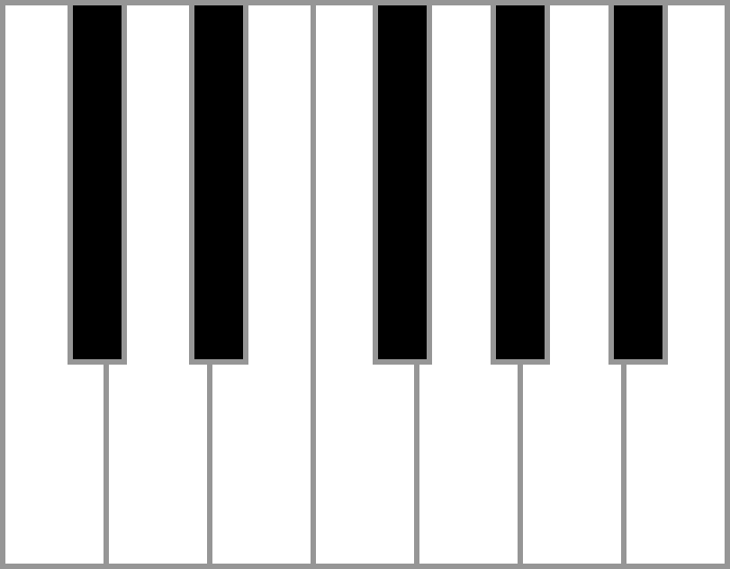

# Piano_Keyboard

This crate provides the graphical elements in order to draw a piano keyboard
with close to realistic appearance.

As reference has been used internet resource displaying an
[octave drawing](http://www.rwgiangiulio.com/construction/manual/layout.jpg).
The dimensions described there have been used to create the elements of
a piano keyboard, which can be used to create for example an octave like this:

The graphical representation only provides the white and black areas for the keys.
It is visible, that between white keys and even between white and black keys a gap
is ensured.

The gap between white and black keys can be removed by an option of the KeyboardBuilder.

The interface is prepared to be compatible for an extension towards a 3d keyboard.
That's why the returned keyboard is called Keyboard2D and the related build function
is called build2d().

